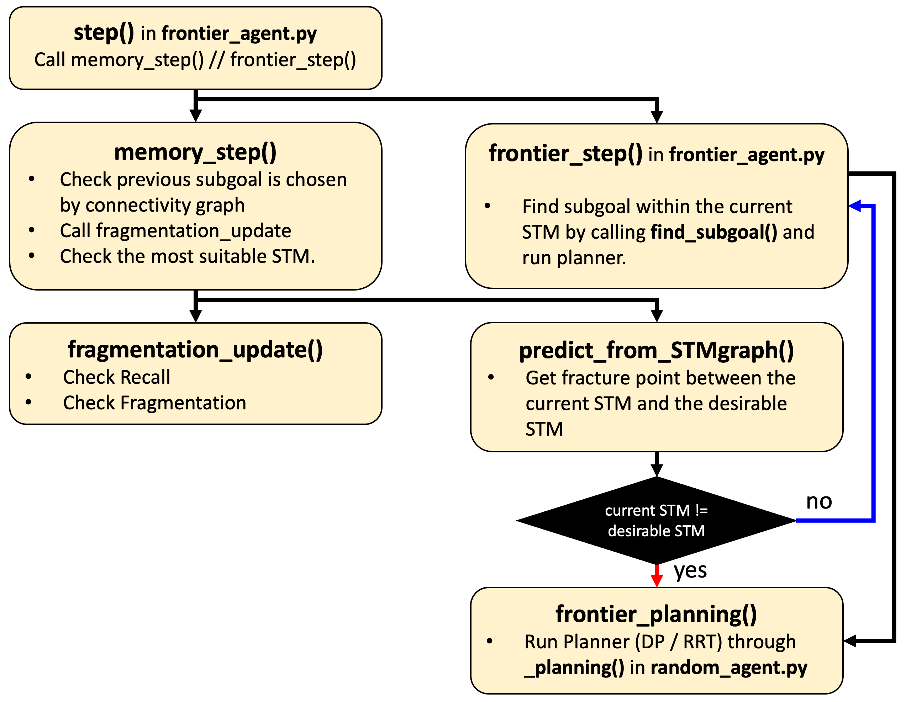

# Neuro-Inspired Efficient Exploration via Fragmentation and Recall in Procedually-Generated Environments

## Run Experiments
`python3 run_exp.py -wandb -env $ENV`

## Modules

### Surprisal Prediction Submodule
* Just a neural network
* Input: `obs`, in (3, H, W)
* Outout: surprisal map, in (4, H, W), 4 is referred to as the head direction.

### Short-Term Memory (STM)
* Variables

  * `id`: integer, the id of STM.
  * `map`: (C, H, W), one-hot confidence map that based on observations. 
  * `current`: (x, y), current location in the map.
  * `loc_diff_stms`: a dictionary, `{id: loc}`, the id of connected STM and the locations of fragmentation happens.
  * `pixel_value`: a dictionary, `{pixel_value : idx}`, original pixel values for each dimension of `map`.
  * `decaying_factor`: float, exponential decaying factor for memory.

* Functions
  * `update_by_rel(state, rel_position)`: **write** operation, update `map` based on the `state` and previous action, `rel_position`.
  * `get_map(action, head, dh, dw)`: **read** operation, return the confidence map of the position move to `(dh, dw)` and the head direction, `head`. `action` is deprecated.

### Long-Term Memory (LTM)
* Variables
  * `memory`: dictionary, `{obs: [STMs]}` since it is possible that fragmentation happens on the same observation multiple times, it is implemented as a list. However, in practice, I only use the latest STM.
  * `memory_list`: list of `(stm_id, score, STM)`
  * `dist_map`: dictionary of dictionary for sparse matrix of distance between STMs. 

* Functions
  * `read(obs)`: `return STM || None` recall memory based on the input state.
  * `write(obs, stm, score)`: `return new STM` write STM with state into `memory` and with its id and score in `memory_list`.
  * `predict_from_STMgraph(stm)`: `return None || (fragmentation location, desirable STM)` find desirable STMs and if it is not the same as the input STM (i.e., current STM), return fragmentation location to reach out to desirable STM and the STM.

Note that all STMs in LTM are actually stored as a address of the object.

## Code Diagram

